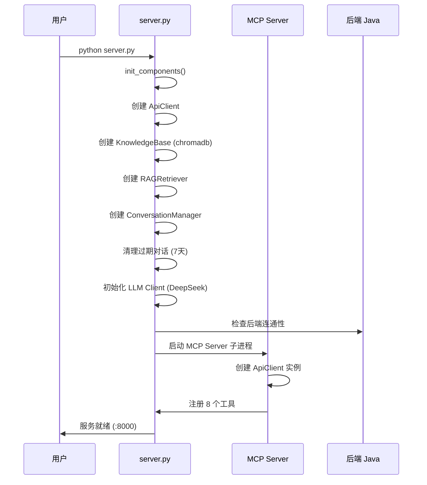
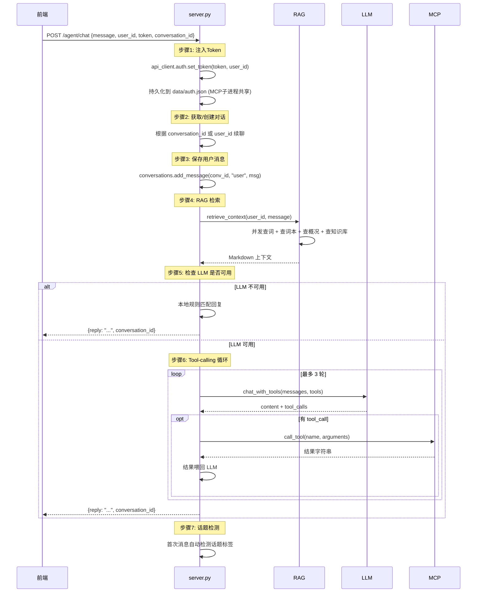

# 背单词助手 AI Agent — 技术文档

> 版本: 0.2.0 | 更新: 2026-06-02

---

## 目录

1. [项目概览](#1-项目概览)
2. [系统架构](#2-系统架构)
3. [模块详解](#3-模块详解)
4. [数据流](#4-数据流)
5. [API 参考](#5-api-参考)
6. [配置说明](#6-配置说明)
7. [开发指南](#7-开发指南)
8. [部署指南](#8-部署指南)

---

## 1. 项目概览

### 1.1 这是什么

一个基于 **FastAPI + DeepSeek + MCP 协议** 的 AI Agent 中间层。位于前端 App 和后端 Java 服务之间，把自然语言翻译成 API 调用。

```
用户 App (前端) ──→ Agent 服务 (:8000) ──→ 后端 Java (:8080)
                        │
                        └── DeepSeek LLM (云端 API)
```

### 1.2 核心能力

- **自然语言对话**：用户说"beautiful 是什么意思"，Agent 查词典 + 查用户词本，返回带个人数据的回答
- **智能工具调用**：用户说"帮我签到并查积分"，LLM 自动拆解为两步操作
- **知识库问答**：支持上传文档，用向量检索做语义搜索
- **三层降级**：LLM 挂 → 规则匹配，后端挂 → 跳过，Token 过期 → 提示重新登录

### 1.3 技术栈

| 层 | 技术 |
|---|------|
| Web 框架 | FastAPI + Uvicorn |
| LLM | DeepSeek Chat（兼容 OpenAI SDK） |
| 工具协议 | MCP（Model Context Protocol） |
| 向量检索 | chromadb + ONNX embedding（all-MiniLM-L6-v2） |
| 并发模型 | asyncio + httpx |
| 数据格式 | Pydantic v2 |
| 日志 | loguru |

---

## 2. 系统架构

### 2.1 模块总览

```
flashword/
│
├── server.py                       ← FastAPI 主入口 (HTTP 服务)
├── mcp_server.py                   ← MCP 服务端子进程 (stdio 通信)
├── main.py                         ← CLI 入口 (旧模式)
│
├── api/                            ← 后端通信层
│   ├── client.py                   ←   通用 HTTP 客户端 (requests)
│   ├── endpoints.py                ←   业务 API 封装
│   ├── auth.py                     ←   JWT Token 管理
│   └── schemas.py                  ←   Pydantic 请求/响应模型
│
├── agent/                          ← AI 核心逻辑
│   ├── llm.py                      ←   LLM 客户端 (DeepSeek)
│   ├── rag.py                      ←   检索增强生成
│   ├── knowledge_base.py           ←   向量知识库 (chromadb)
│   ├── mcp_client.py               ←   MCP 协议客户端
│   ├── conversation.py             ←   对话历史管理
│   ├── tools.py                    ←   旧工具系统 (仅 main.py 使用)
│   ├── core.py                     ←   旧 Agent 实现 (仅 main.py 使用)
│   └── memory.py                   ←   简单键值记忆
│
├── config/
│   └── settings.py                 ← 配置读取 (.env)
│
└── data/                           ← 运行时数据
    ├── conversations/              ←   对话历史 (JSON)
    ├── chroma_db/                  ←   向量数据库 (chromadb)
    ├── knowledge_docs.json         ←   知识库文档注册表
    ├── auth.json                   ←   Token 持久化
    ├── memory.json                 ←   简单记忆
    └── agent.log                   ←   运行日志
```

### 2.2 启动流程



### 2.3 进程模型

```
┌─────────────────────────────┐
│   server.py (主进程)         │  ← HTTP 服务
│   - FastAPI 路由            │     负责接收前端请求
│   - MCPClient (MCP 客户端)   │
│   - LLMClient (DeepSeek)    │
│   - RAGRetriever            │
│   - ConversationManager     │
│   - KnowledgeBase           │
└──────────┬──────────────────┘
           │ stdio (JSON-RPC)
           ▼
┌─────────────────────────────┐
│   mcp_server.py (子进程)     │  ← MCP 服务端
│   - ApiClient               │     负责执行后端 API 调用
│   - 8 个工具定义            │
│   - 工具结果格式化          │
└─────────────────────────────┘
```

**为什么拆成两个进程？**

MCP 协议通过 stdio 隔离子进程，带来两个好处：
- **稳定性**：工具执行崩溃不会拖垮主进程
- **权限控制**：子进程有独立的 ApiClient，需要 `_reload_auth()` 从共享文件读取 Token

---

## 3. 模块详解

### 3.1 api/client.py — HTTP 客户端

统一的 HTTP 请求封装，所有后端 API 调用经过此模块。

```python
class ApiClient:
    def request(method, path, params, data, need_auth=True) -> Any
```

**关键设计：**
- 自动附加 `Authorization: Bearer <token>` 头部
- 后端统一响应格式 `{code, message, data}`，在 client 层解包
- 401 自动清除 Token
- 连接超时、HTTP 错误统一以 `ApiError` 抛出

### 3.2 api/endpoints.py — 业务 API 封装

把后端 REST 接口封装为 Python 方法，每个方法一个 API 调用。

**现有工具映射：**

| 方法 | HTTP 调用 | 用途 |
|------|----------|------|
| `search_word(keyword)` | `GET /word/search` | 查单词 |
| `ai_fill_word(word_text)` | `POST /word/ai-fill` | AI 补全单词 |
| `get_points_balance()` | `GET /store/points/balance` | 查积分 |
| `checkin()` | `POST /store/checkin` | 签到 |
| `get_store_books(page, size)` | `GET /store/books` | 商店词书 |
| `get_flash_sale_list()` | `GET /store/flash-sale/list` | 秒杀列表 |
| `get_book_list(user_id)` | `GET /vocabulary-book/list/{id}` | 用户词本 |
| `get_words_by_book(book_id)` | `GET /vocabulary-book/words` | 词本单词 |
| `get_user_info(user_id)` | `GET /user/{id}` | 用户信息 |
| `purchase_flash_sale(activity_id)` | `POST /store/flash-sale/purchase/{id}` | 秒杀购买 |

### 3.3 api/auth.py — JWT Token 管理

```python
class AuthManager:
    - save_session(session)    # 持久化到 data/auth.json
    - load_session()           # 从内存加载
    - get_token()              # 获取当前 Token
    - set_token(token, ...)    # 动态设置（从请求注入）
    - clear()                  # 清除（401 时自动调用）
```

**Token 流动路径：**

```
前端登录 → 后端返回 JWT Token
         → 前端存 Token
         → 前端请求 /agent/chat 时带着 token
         → server.py 将 token 注入 ApiClient (内存)
         → server.py 将 token 写入 data/auth.json (持久化)
         → MCP Server 子进程每次调用工具前读 auth.json (_reload_auth)
```

### 3.4 agent/llm.py — LLM 集成

对接 DeepSeek API，兼容 OpenAI SDK。

**两个核心方法：**

```python
class LLMClient:
    def chat(messages, system_prompt) -> str
        # 纯文本回复，无工具调用

    def chat_with_tools(messages, system_prompt, tools) -> (content, tool_calls)
        # 支持 Function Calling，返回文本 + 工具调用列表
```

**重试策略：**

| 错误类型 | 行为 |
|---------|------|
| RateLimitError | 指数退避重试（1s → 2s → 4s），最多 3 次 |
| APITimeoutError | 重试 3 次 |
| 500 ≤ status_code | 重试 3 次 |
| 400 ≤ status_code < 500 | 直接返回错误消息 |
| 其他异常 | 直接返回错误消息 |

### 3.5 agent/rag.py — RAG 检索

并发执行最多 **4 个检索任务**，结果合并为 Markdown 上下文：

```
用户输入 → _extract_words() 提取英文单词
         → 并发执行:
             1. _search_public_word(word)    — 公共词典
             2. _search_my_word(user_id, word) — 用户个人词本
             3. _get_user_profile(user_id)    — 学习概况
             4. _search_knowledge_base(...)   — 向量知识库
         → 按标题去重 → 拼装上下文字符串
```

**缓存机制：**

```python
class _LRUCache:
    - 最大 128 条目
    - 默认 TTL 60 秒
    - 最近最少使用淘汰
    - 单词查询 TTL 120 秒（变化慢）
```

**上下文示例输出：**

```markdown
## 单词查询
单词: beautiful | 音标: /ˈbjuːtɪfl/ | 词性: adj. | 释义: 美丽的 | 例句: ...

## 我的单词本
beautiful | 释义: 美丽的 | 标签: 四级 | 笔记: 常考

## 用户学习概况
- 积分余额: 1250
- 用户名: 小明
- 单词本数量: 3
  - [1] 《四级词汇》(购买) — 500 词
  - [2] 《我的生词本》(自建) — 23 词

## 知识库匹配
- [AI概述](相似度: 0.74) 人工智能是计算机科学的一个分支...
```

### 3.6 agent/knowledge_base.py — 向量知识库

基于 **chromadb + ONNX embedding (all-MiniLM-L6-v2)**，零 torch 依赖。

```python
class KnowledgeBase:
    def add_document(title, content, user_id=0) -> dict
        # 分块 → embedding → 存入 chromadb
        # 返回 {id, title, chunk_count}

    def search(query, top_k=3, user_id=None) -> list[dict]
        # 查询 → 向量相似度 → 返回 [content, title, doc_id, score]

    def list_documents() -> list[dict]
        # 列出所有文档

    def delete_document(doc_id) -> bool
        # 删除文档及其所有向量片段
```

**分块策略：**

```
长文本 → 段落(\n\n)切割 → 句子(。！？.!?)切割 → 500字硬切
                                                        ↓
                                               每块重叠50字
```

**存储结构：**

```
data/
├── chroma_db/              ← chromadb 自动管理的向量索引
│   ├── chroma.sqlite3
│   └── ...
└── knowledge_docs.json     ← 文档注册表 {doc_id: {title, chunk_count, user_id}}
```

### 3.7 agent/mcp_client.py — MCP 客户端

管理 MCP Server 子进程的生命周期：

```python
class MCPClient:
    async def connect()           # 启动子进程 + 建立连接
    async def call_tool(name, arguments) -> str
    async def close()            # 关闭连接 + 终止子进程
    def get_tool_defs()          # 返回 OpenAI function calling 格式
    def get_tool_descriptions()  # 返回 Markdown 工具描述
```

**MCP 通信协议：**

```
主进程                             子进程 (mcp_server.py)
  │                                   │
  │──── initialize ──────────────────→│
  │←────────── initialized ──────────│
  │──── list_tools ──────────────────→│
  │←─────── 8 tools ────────────────│
  │──── call_tool("search_word") ───→│
  │                                   │──→ 后端 API
  │←──── formatted result ──────────│
```

### 3.8 agent/conversation.py — 对话管理

```python
class ConversationManager:
    def create_conversation(user_id) -> str        # 新建对话
    def find_by_user(user_id) -> str | None        # 按用户找最近对话
    def add_message(conv_id, role, content)        # 添加消息
    def get_history(conv_id, limit=10) -> list     # 获取历史
    def update_metadata(conv_id, **kwargs)          # 更新元数据
    def clean_expired(max_age_days=7) -> int       # 清理过期
    def clear(conv_id)                              # 删除对话
```

**自动摘要触发条件：**

```
消息数 >= 15 条 → 前 N-10 条压缩为摘要
               → 保留最近 10 条完整消息
               → 摘要作为 system message 前置

对话文件示例 (data/conversations/{id}.json):
{
  "id": "a1b2c3d4e5f6",
  "user_id": 1,
  "created_at": 1717000000,
  "last_active": 1717003600,
  "message_count": 15,
  "topic": "单词查询",
  "summary": "用户: beautiful是什么意思\nAI: beautiful 是形容词...",
  "messages": [...]   ← 最近 10 条
}
```

### 3.9 server.py — 主入口

**请求处理流程：**



**健康检查端点返回：**

```json
{
  "status": "ok",
  "version": "0.2.0",
  "llm_ready": true,
  "mcp_ready": true,
  "knowledge_base": true,
  "uptime_s": 3600,
  "memory_mb": 45.2,
  "rag_cache_size": 5
}
```

---

## 4. 数据流详解

### 4.1 完整请求示例

**用户输入：** "beautiful 是什么意思，顺便帮我签到"

```
步骤                          耗时估算   涉及模块
─────────────────────────────────────────────────────
1. HTTP 请求解析               <1ms      FastAPI
2. Token 注入 + 持久化         <5ms      auth.py
3. 获取/创建对话               <2ms      conversation.py
4. 保存用户消息                <2ms      conversation.py
5. RAG 检索 (并发 3 个任务)    ~30ms     rag.py
   ├─ 查词 beautiful          ~15ms     endpoints → HTTP
   ├─ 查个人词本 beautiful    ~15ms     endpoints → HTTP
   └─ 查用户概况               ~30ms     endpoints → HTTP (3个子请求)
6. LLM 调用 (DeepSeek API)    ~500ms     llm.py
7. Tool-calling 第1轮
   ├─ 签到                     ~30ms     MCP → HTTP
   └─ 结果喂回 LLM            ~500ms     llm.py
8. 保存回复 + 话题检测         <2ms      conversation.py
9. HTTP 响应                   <1ms      FastAPI

总计: ~1.1 秒 (主要开销在 LLM API)
```

### 4.2 Token 流动路径

```
┌─────────┐    JWT Token     ┌──────────┐
│  前端    │ ──────────────→  │ server.py │
└─────────┘                  │ (主进程)  │
                             └────┬─────┘
                                  │
                    ┌─────────────┼─────────────┐
                    │ 内存        │ 文件          │
                    ▼             ▼              │
             ┌──────────┐  ┌──────────┐          │
             │ ApiClient│  │auth.json │          │
             │ .auth    │  │(持久化)  │          │
             └──────────┘  └────┬─────┘          │
                                │                 │
                         MCP 子进程读取           │
                                ▼                 │
                          ┌──────────┐            │
                          │ mcp_     │            │
                          │ server.py│            │
                          │ ._client │            │
                          │ .auth    │            │
                          └──────────┘            │
```

---

## 5. API 参考

### 5.1 聊天接口

```
POST /agent/chat
```

**请求：**
```json
{
  "message": "beautiful 是什么意思",
  "user_id": 1,
  "conversation_id": "abc123",
  "token": "eyJhbGciOiJIUzI1NiIs..."
}
```

| 字段 | 必填 | 说明 |
|------|------|------|
| `message` | 是 | 用户消息 |
| `user_id` | 否 | 用户 ID，传了会续上次对话 |
| `conversation_id` | 否 | 续聊时传，不传则新建 |
| `token` | 否 | 后端 JWT Token |

**响应：**
```json
{
  "reply": "「beautiful」是形容词，音标 /ˈbjuːtɪfl/，意思是「美丽的」。已帮你签到成功，获得 10 积分！",
  "conversation_id": "abc123"
}
```

### 5.2 知识库接口

| 接口 | 方法 | 说明 |
|------|------|------|
| `/agent/knowledge/upload` | POST | 上传文档 |
| `/agent/knowledge/documents` | GET | 列出文档 |
| `/agent/knowledge/documents/{doc_id}` | DELETE | 删除文档 |
| `/agent/knowledge/search` | POST | 搜索知识库 |

**上传文档：**
```
POST /agent/knowledge/upload
{
  "title": "AI 概述",
  "content": "人工智能是计算机科学的一个分支...",
  "user_id": 1
}
```

### 5.3 单词补全接口

```
POST /agent/word/enrich
{
  "word_text": "beautiful",
  "user_id": 1
}
```

### 5.4 对话管理接口

| 接口 | 方法 | 说明 |
|------|------|------|
| `/agent/health` | GET | 健康检查 |
| `/agent/conversations/{id}/history` | GET | 查看历史 |
| `/agent/conversations/{id}` | DELETE | 删除对话 |

---

## 6. 配置说明

### 6.1 环境变量 (`.env`)

```ini
# 后端 API 地址
API_BASE_URL=http://localhost:8080/api

# Agent HTTP 服务
AGENT_HOST=0.0.0.0
AGENT_PORT=8000

# LLM 配置（DeepSeek，兼容 OpenAI）
LLM_API_KEY=sk-your-deepseek-api-key
LLM_BASE_URL=https://api.deepseek.com/v1
LLM_MODEL=deepseek-chat
LLM_TEMPERATURE=0.7
LLM_MAX_TOKENS=1024

# LLM 重试配置
LLM_RETRY_MAX=3
LLM_RETRY_DELAY=1.0

# 工具执行超时（秒）
TOOL_EXECUTION_TIMEOUT=15

# 日志级别: DEBUG, INFO, WARNING, ERROR
LOG_LEVEL=INFO
```

### 6.2 完整配置项 (`config/settings.py`)

| 配置 | 默认值 | 说明 |
|------|--------|------|
| `API_BASE_URL` | `http://localhost:8080/api` | 后端地址 |
| `API_TIMEOUT` | 30 | API 超时(秒) |
| `AGENT_HOST` | `0.0.0.0` | Agent 监听地址 |
| `AGENT_PORT` | 8000 | Agent 端口 |
| `LLM_API_KEY` | `""` | DeepSeek API Key |
| `LLM_BASE_URL` | `https://api.deepseek.com/v1` | LLM 地址 |
| `LLM_MODEL` | `deepseek-chat` | 模型名 |
| `LLM_MAX_TOKENS` | 1024 | 最大 token |
| `LLM_TEMPERATURE` | 0.7 | 温度参数 |
| `LLM_RETRY_MAX` | 3 | 重试次数 |
| `TOOL_CALL_MAX_ROUNDS` | 3 | 工具调用轮数上限 |
| `CONVERSATION_MAX_AGE_DAYS` | 7 | 对话保留天数 |
| `LOG_LEVEL` | `INFO` | 日志级别 |
| `LOG_FILE` | `data/agent.log` | 日志路径 |

---

## 7. 开发指南

### 7.1 新增一个工具

**第 1 步：后端 Java 加接口**

假设后端新增 `POST /api/store/purchase/{bookId}`。

**第 2 步：`api/endpoints.py` 加方法**

```python
def purchase_book(self, book_id: int) -> dict:
    return self._c.post(f"/store/purchase/{book_id}")
```

**第 3 步：`mcp_server.py` 注册为 MCP 工具**

```python
@mcp.tool(description="购买指定的单词书")
def purchase_book(book_id: int) -> str:
    """购买单词书"""
    _reload_auth()
    try:
        result = api.purchase_book(book_id)
        return f"购买成功! 订单号: {result.get('orderId', '')}"
    except ApiError as e:
        return f"购买失败: {e}"
```

**第 4 步（可选）：RAG 加相应检索**

在 `rag.py` 的 `retrieve_context()` 中添加新的检索任务。

### 7.2 本地调试

```bash
# 1. 确保后端 Java 已启动

# 2. 启动 Agent
cd flashword
.venv/Scripts/python.exe server.py

# 3. 测试聊天
curl -X POST http://localhost:8000/agent/chat \
  -H "Content-Type: application/json" \
  -d "{\"message\":\"hello\",\"user_id\":1}"

# 4. 测试健康检查
curl http://localhost:8000/agent/health

# 5. 测试知识库上传
curl -X POST http://localhost:8000/agent/knowledge/upload \
  -H "Content-Type: application/json" \
  -d "{\"title\":\"测试\",\"content\":\"这是测试内容\"}"
```

### 7.3 测试工具列表

| 场景 | curl 命令 |
|------|-----------|
| 查单词 | `curl -X POST ... -d "{\"message\":\"beautiful 是什么意思\"}"` |
| 签到 | `curl -X POST ... -d "{\"message\":\"帮我签到\"}"` |
| 查积分 | `curl -X POST ... -d "{\"message\":\"看看我多少积分\"}"` |
| 查词本 | `curl -X POST ... -d "{\"message\":\"我的单词本有什么词\"}"` |
| 秒杀 | `curl -X POST ... -d "{\"message\":\"有什么秒杀活动\"}"` |
| 复合指令 | `curl -X POST ... -d "{\"message\":\"查积分并签到\"}"` |

---

## 8. 部署指南

### 8.1 环境要求

- Python 3.10+
- 可以访问 DeepSeek API（国内网络）
- 后端 Java 服务 :8080（可选，降级可用）

### 8.2 安装部署

```bash
# 克隆
git clone <repo>
cd python-agent

# 创建虚拟环境
python -m venv .venv
.venv/Scripts/activate

# 安装依赖
pip install -r requirements.txt

# 配置环境变量
cp .env.example .env
# 编辑 .env 填入 LLM_API_KEY

# 启动
.venv/Scripts/python.exe server.py
```

### 8.3 生产化建议

| 项目 | 建议 |
|------|------|
| 进程管理 | 用 `nssm` (Windows) 或 `supervisor` (Linux) 注册为系统服务 |
| 日志 | loguru 自动按 10MB 轮转 |
| 监控 | `/agent/health` 接口，配合 Prometheus + Grafana |
| 安全 | `.env` 不要提交到 Git，用 CI/CD 变量注入 |
| 性能 | LLM 调用是主要瓶颈 (~500ms)，可考虑流式响应 SSE |

---

> 文档生成时间: 2026-06-02
> 如有问题或建议，请提交 Issue 或 PR。
